# Converge v1


# Converge

**The Digital Concierge for Collaborative Decision Making.**

Converge solves group decision paralysis. It is a real-time messaging platform where an AI Agent named "Connie" acts as a first-class participant. By listening to natural conversation, retrieving data from the **Yelp AI API**, and rendering interactive "Generative UI" voting cards, Converge turns endless planning texts into a single decision.

---

## 🚀 Inspiration
We've all been there: the group chat "dinner dance." Endless links pasted, "I don't care, you pick," lost context, and frustration. Local search is solitary, but decision-making is social. Converge was built to mediate this friction by moving beyond static search results to an agentic, collaborative workflow that understands intent and facilitates action.

## ✨ Key Features

- **🤖 Agentic Mediation**: Chat naturally with "Connie." She understands intent (e.g., "We need cheap sushi near downtown") not just keywords.
- **🎨 Generative UI**: The AI doesn't just reply with text; it proactively renders interactive **Proposal Cards** directly into the chat stream.
- **🗳️ Real-Time Voting**: Users can vote on proposed venues instantly. Vote counts update live across all connected clients via WebSockets.
- **🧠 Intelligent Summaries**: Leverages Yelp's AI-generated business summaries and review highlights to give users qualitative context (e.g., "Best vegan pizza").
- **🏆 Auto-Decision**: Ask "Who won?" and the agent tallies the database votes to declare a winner.

## 🏗️ Architecture

Converge utilizes a centralized Next.js backend to orchestrate AI tools and a decentralized frontend synchronized by Supabase Realtime.

```mermaid
%%{init: {'theme': 'base', 'themeVariables': { 'primaryColor': '#E11D3E', 'secondaryColor': '#f4f4f5', 'tertiaryColor': '#fff', 'mainBkg': '#fcfcfc', 'nodeBorder': '#e5e7eb'}}}%%
graph TD
    subgraph "Frontend"
        Client[📱/💻 Client Browser React/Tailwind]
    end

    subgraph "Backend Orchestration (Next.js 15)"
        API_Route[⚡ Route Handler /api/chat]
        AI_SDK[🤖 Vercel AI SDK]
        ServerAction[🔄 Server Actions vote/sync]
    end

    subgraph "Data Layer (Supabase)"
        DB[(🗄️ PostgreSQL DB messages/votes)]
        Realtime[📡 Realtime Subscriptions]
    end

    subgraph "Intelligence & Data"
        Yelp[🔴 Yelp AI API v2]
        LLM[🧠 OpenAI GPT-4o]
    end

    %% Chat Flow
    Client -->|1. Send Message| API_Route
    API_Route -->|2. Stream Text & Manage Tools| AI_SDK
    AI_SDK <-->|3. Reasoning & Tool Decisions| LLM
    AI_SDK -->|4. Execute 'searchYelp' Tool| Yelp
    Yelp -->|5. Business Data & Summaries| AI_SDK
    
    %% Generative UI Flow
    AI_SDK -->|6. Execute 'renderProposal' Tool| API_Route
    API_Route -->|7. Store Tool Payload JSON| DB
    DB -->|8. Broadcast Payload| Realtime
    Realtime -->|9. Render Interactive Card| Client

    %% Voting Flow
    Client -->|10. Click Vote| ServerAction
    ServerAction -->|11. Insert Vote| DB
    DB -->|12. Broadcast Vote Update| Realtime
    Realtime -->|13. Update Vote Count UI| Client

```



## 🛠️ Built With

* **Framework**: Next.js 15 (App Router), React, TypeScript
* **Styling**: Tailwind CSS, Shadcn/UI
* **AI & Orchestration**: Vercel AI SDK, OpenAI (GPT-4o)
* **Data Source**: **Yelp AI API** (v2)
* **Backend & Realtime**: Supabase (PostgreSQL, Realtime)

## 📍 Yelp AI API Integration

Converge is built entirely around the **Yelp AI API (`/v2/ai/chat`)**. We rely on it as the single source of truth for:

1. **Reasoning**: We pass user location and natural language queries to Yelp to find the best matching candidates.
2. **Summarization**: We utilize the `response.text` from Yelp to populate the "Reasoning" section of our AI agent's response.
3. **Review Snippets**: We display the context-aware `review_snippet` (with `[[HIGHLIGHT]]` tags) directly on the cards to show users *why* a place fits their specific request.

## ⚙️ Getting Started

### Prerequisites

* Node.js & pnpm
* A Supabase Project
* A Yelp Fusion API Key
* An OpenAI API Key

### 1. Clone the repo

```bash
git clone [https://github.com/mikoaro/converge.git](https://github.com/mikoaro/converge.git)
cd converge

```

### 2. Install dependencies

```bash
pnpm install

```

### 3. Environment Variables

Create a `.env.local` file in the root directory:

```env
# AI & Data
OPENAI_API_KEY=sk-...
YELP_API_KEY=your_yelp_api_key

# Database (Supabase)
NEXT_PUBLIC_SUPABASE_URL=[https://your-project.supabase.co](https://your-project.supabase.co)
NEXT_PUBLIC_SUPABASE_ANON_KEY=your_anon_key
SUPABASE_SERVICE_ROLE_KEY=your_service_role_key

```

### 4. Database Setup

Run the following SQL in your Supabase SQL Editor to set up the schema and Realtime listeners:

```sql
-- Enable UUIDs
create extension if not exists "uuid-ossp";

-- Sessions
create table public.sessions (
  id uuid default uuid_generate_v4() primary key,
  created_at timestamp with time zone default timezone('utc'::text, now()) not null,
  status text default 'active'
);

-- Messages
create table public.messages (
  id uuid default uuid_generate_v4() primary key,
  session_id uuid references public.sessions(id) not null,
  created_at timestamp with time zone default timezone('utc'::text, now()) not null,
  content text,
  role text, 
  tool_payload jsonb,
  sender_id uuid
);

-- Votes
create table public.votes (
  id uuid default uuid_generate_v4() primary key,
  session_id uuid references public.sessions(id) not null,
  business_id text not null,
  user_id text not null, 
  value integer default 1,
  created_at timestamp with time zone default timezone('utc'::text, now()) not null
);

-- Enable Realtime
alter publication supabase_realtime add table messages;
alter publication supabase_realtime add table votes;

-- Enable RLS
alter table public.votes enable row level security;
create policy "Public Access" on public.votes for all using (true) with check (true);
alter table public.messages enable row level security;
create policy "Public Access" on public.messages for all using (true) with check (true);

```

### 5. Run the Application

```bash
pnpm dev

```

Open [http://localhost:3000](https://www.google.com/search?q=http://localhost:3000) with your browser.

## 📸 How it Works

1. **The Hook**: Start a session. Type "Find sushi near downtown."
2. **The Brain**: The backend calls the Yelp AI API with your intent and location.
3. **The UI**: "Connie" triggers the `showProposalCard` tool, rendering a React component with 3 Yelp options.
4. **The Vote**: Click "Vote" on a card. The state updates in Supabase and reflects instantly on all other screens.
5. **The Win**: Ask "Who won?" and Connie declares the winner.

## 🔮 What's Next

* **Native Mobile App**: Porting the frontend to React Native (Expo) for on-the-go coordination.
* **Reservations**: Integrating Yelp's booking endpoints to close the loop.
* **Multi-Stop Itineraries**: Planning a full night (Dinner → Drinks) in one flow.

## 📄 License

MIT

```


